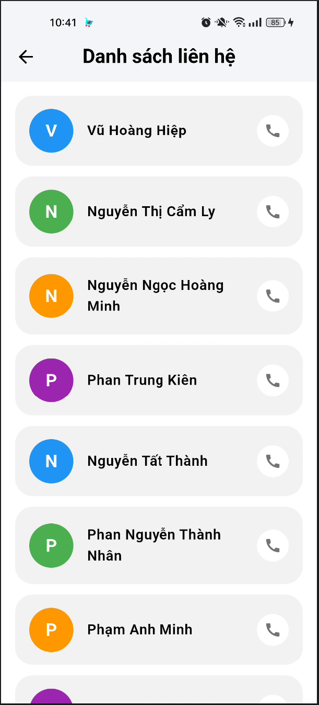
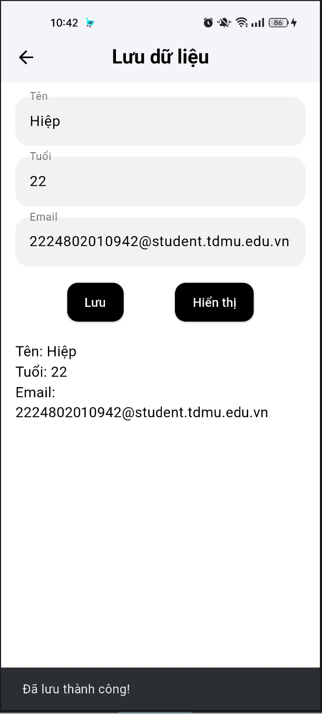
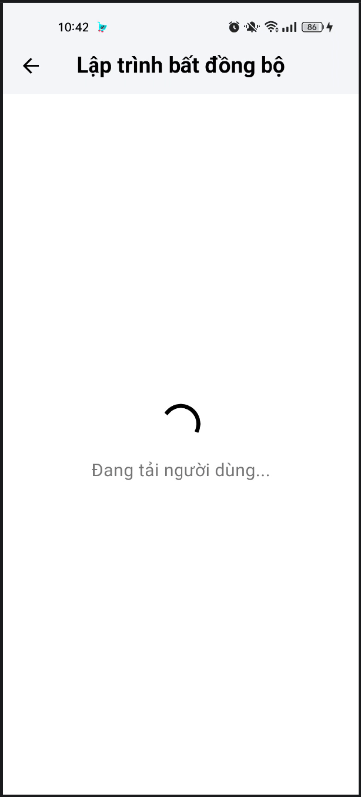

# Exercise_week_4
## 1. List View Exercise

<p align="center">
  
</p>

---

## 2. Grid View Exercise

<p align="center">
  
</p>

---

## 3. Shared Preferences Exercise

<p align="center">
  
</p>

---

## 4. Asynchronous Programming Exercise

<p align="center">
  
  
</p>

---

## 🛠️ Công nghệ sử dụng
- Flutter
- Dart

---

## ▶️ Cách chạy project

```bash
flutter pub get
flutter run